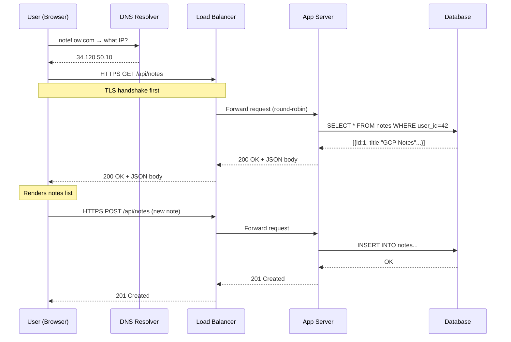

## PROBLEM

You built NoteFlow as a single desktop app. Every user installs it locally. Their notes live on their own machine. One day a user switches laptops — all notes are gone. Another user wants to share a note with a colleague — impossible. A third user edits a note on mobile but their desktop still shows the old version. Your app works in isolation but fails the moment more than one device or person is involved.

## NEED

A local-only application has no way to share state between devices or users. You could try syncing files via email or USB — but that breaks the moment two people edit simultaneously, or the moment a user is offline and comes back. You need a central place that holds the truth, that every device can talk to, and that can handle many devices at once. The local model fundamentally cannot scale beyond one person on one device.

## ANALOGY

Think of a restaurant. You (the customer) are the **client** — you sit at a table, look at a menu, and place an order. The kitchen is the **server** — it holds all the ingredients, knows how to prepare food, and processes requests. You don't walk into the kitchen and cook yourself. You send a request through a waiter (the **network**), the kitchen processes it, and sends back a response (your food). Multiple customers can place orders simultaneously. The kitchen manages the queue. You never see how the food is made — only the result arrives at your table.

## SOLUTION

**The Client-Server Model**: An architectural pattern where two distinct roles exist — a **client** that initiates requests and consumes responses, and a **server** that listens for requests, processes them, and returns responses. All communication is initiated by the client. The server never pushes unsolicited data (in the basic model).

## KEY TERMS

- **Client**: Any device or application that sends requests — browser, mobile app, desktop app, another server
- **Server**: A program that listens on a network port, processes incoming requests, and returns responses
- **Request**: A structured message sent from client to server — contains method, URL, headers, optional body
- **Response**: The server's reply — contains status code, headers, and optional body
- **Protocol**: The agreed-upon rules for how messages are formatted and exchanged (HTTP, HTTPS, WebSocket, gRPC)
- **Port**: A logical channel on a machine — servers listen on specific ports (HTTP = 80, HTTPS = 443)
- **IP Address**: The unique network address of a machine
- **DNS**: Translates human-readable domain names (`noteflow.com`) into IP addresses
- **Stateless**: Each request contains all the information needed — the server holds no memory of past requests
- **Request-Response Cycle**: The complete round trip from client sending a request to receiving a response
- **Latency**: Time for one request-response cycle to complete
- **Bandwidth**: Volume of data that can be transferred per second

## HOW IT WORKS

1. **User action triggers a request** — user opens NoteFlow in browser, types `noteflow.com`
2. **DNS resolution** — browser asks DNS resolver: "what IP is noteflow.com?" → gets back `34.120.50.10`
3. **TCP connection** — browser opens a TCP connection to that IP on port 443 (HTTPS)
4. **TLS handshake** — client and server negotiate encryption keys (for HTTPS)
5. **HTTP request sent** — browser sends:
   ```
   GET /api/notes HTTP/1.1
   Host: noteflow.com
   Authorization: Bearer <token>
   Accept: application/json
   ```
6. **Server receives request** — server's listening process accepts the connection from its queue
7. **Server processes request** — validates auth token → queries database → formats results
8. **Server sends response**:
   ```
   HTTP/1.1 200 OK
   Content-Type: application/json
   
   {"notes": [...]}
   ```
9. **Client receives response** — browser parses JSON, renders the notes list
10. **Connection may be reused** — HTTP/1.1 keep-alive or HTTP/2 multiplexing avoids reconnecting for every request

**What happens on failure:**
- Server is down → client gets connection refused or timeout → shows error state
- Server crashes mid-request → client gets no response → timeout after N seconds
- Network partition → packets lost → TCP retries, eventually times out

## CODE

```python
# --- SERVER SIDE (Python/Flask) ---
from flask import Flask, request, jsonify

app = Flask(__name__)

# Server listens for incoming requests on a route
@app.route('/api/notes', methods=['GET'])
def get_notes():
    # 1. Validate the request
    token = request.headers.get('Authorization')
    if not token:
        return jsonify({'error': 'Unauthorized'}), 401  # 401 = auth required

    # 2. Process: query database
    user_id = validate_token(token)
    notes = db.query('SELECT * FROM notes WHERE user_id = ?', user_id)

    # 3. Return response
    return jsonify({'notes': notes}), 200  # 200 = success


# --- CLIENT SIDE (JavaScript/Fetch API) ---
async function getNotes() {
    // 1. Client initiates request — server never initiates
    const response = await fetch('https://noteflow.com/api/notes', {
        method: 'GET',
        headers: {
            'Authorization': `Bearer ${localStorage.getItem('token')}`,
            'Accept': 'application/json'
        }
    });

    // 2. Check response status before trusting body
    if (!response.ok) {
        if (response.status === 401) redirectToLogin();
        throw new Error(`Request failed: ${response.status}`);
    }

    // 3. Parse and use the response body
    const data = await response.json();
    renderNotes(data.notes);
}
```

## TRADEOFFS

**Performance**: Medium — every operation requires a network round trip (adds latency vs local computation). Mitigated by caching, CDN, and connection pooling. For NoteFlow, a note fetch from Mumbai to a US server adds ~200ms baseline latency.

**Cost**: Low to Medium — centralizing logic on servers means you pay for server compute instead of distributing it to clients. But you control the hardware, can optimize, and clients stay thin.

**Complexity**: Low at small scale, High at large scale — a single server is simple. Once you need multiple servers, load balancers, failover, and distributed state, complexity grows fast.

**Reliability**: Improved for data integrity — notes are never lost because a user's device died. But introduces a new SPOF: if the server goes down, all clients lose access simultaneously. A local app never has this failure mode.

**Scalability**: The server becomes the bottleneck. Clients are stateless and unlimited. Scaling means adding server capacity — horizontally (more instances) or vertically (bigger machine). The client-server model enables this; local-only apps cannot scale at all.

## GCP MAPPING

- **Cloud Run**: Hosts your server-side application code. Stateless containers that auto-scale based on incoming requests. Each container is a server instance handling client requests. Scales to zero when no clients are active.
- **Cloud Load Balancing**: Sits between clients and your Cloud Run instances. Distributes incoming client requests across multiple server instances. Handles SSL termination so your server doesn't have to manage TLS.
- **Cloud Armor**: Sits in front of the load balancer. Protects the server from malicious clients — DDoS mitigation, IP allowlisting, rate limiting at the network edge.
- **Firebase Hosting**: Serves your client-side code (HTML, CSS, JS) from CDN edge nodes globally. The client files live close to users; API calls still go to your Cloud Run server.
- **Internal usage**: Every GCP service you call from your app is itself a client-server interaction — your code is the client, GCP APIs are the server. Cloud Firestore, Cloud Storage, Pub/Sub — all follow this model.

## DIAGRAM



## CHECK QUESTION

NoteFlow's server is stateless — it stores no session data in memory. A user logs in, gets a token, then makes 5 consecutive API requests. Those 5 requests are routed to 5 different server instances by the load balancer. What **specific mechanism** ensures each server instance can still authenticate the user, and what breaks if you remove it?

## CHECK ANSWER

The mechanism is the **JWT (or session token) carried in every request's `Authorization` header**, combined with a **shared secret or public key** that all server instances have access to.

Because the server is stateless, it doesn't store "user X is logged in" anywhere locally. Instead, the client sends its token on every request. Each server instance independently validates the token by verifying its cryptographic signature — no inter-server communication needed. All instances share the same secret key (stored in an environment variable or Secret Manager), so any instance can verify any token.

What breaks if you remove it: if you use server-side sessions instead (storing session data in memory on the server), only the specific instance that created the session can validate it. The other 4 instances have no record of the session and will return 401 Unauthorized. The user appears randomly logged out — 1 in 5 requests fails. This is exactly why stateless auth (JWT) was invented for horizontally scaled systems.
