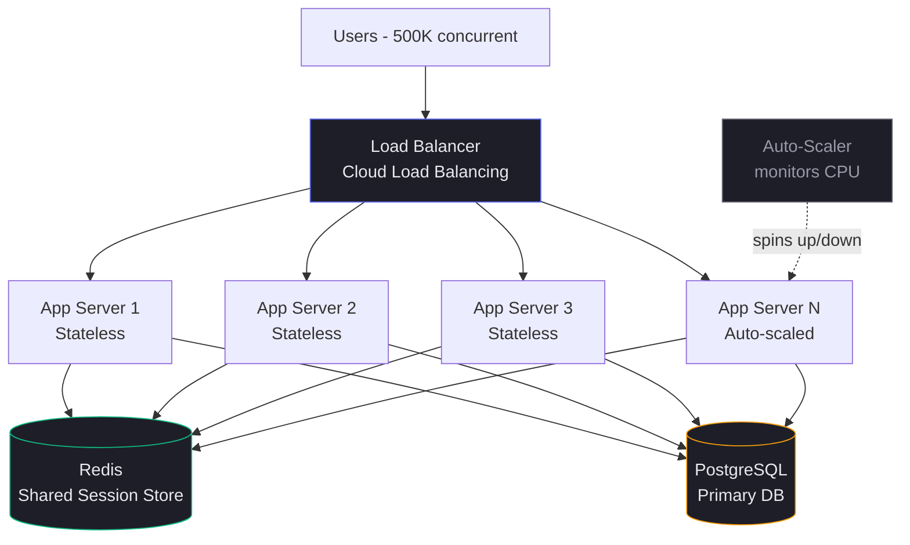

## PROBLEM

You launched NoteFlow. It has 10,000 users. All is well. Then a tech blogger posts about it. Within 2 hours you have 500,000 concurrent users. Your single server — 32 cores, 128GB RAM — is at 100% CPU. Response times go from 80ms to 12 seconds. Users are leaving. You need more capacity. Right now.

## NEED

Your instinct is to get a bigger server. You upgrade to the most powerful machine available — 128 cores, 1TB RAM. It costs $40,000/month. It helps. But three months later, NoteFlow is trending globally. You need 10x again. There is no bigger machine. You have hit the physical ceiling of vertical scaling. And you've also built a single point of failure — when this one machine crashes, everyone goes down.

## ANALOGY

Imagine you run a restaurant. You hire one incredibly fast chef (vertical scaling). He can cook faster and faster — but there's only so fast one person can move. Eventually you can't make him any faster. The alternative: hire 10 normal chefs and run 10 kitchen stations in parallel (horizontal scaling). Each chef handles a subset of orders. You can always add another station when demand grows.

## SOLUTION

**Horizontal Scaling (Scale Out)**: Instead of making one server bigger, add more servers and distribute load across them. Each server handles a fraction of total traffic. You scale by adding nodes, not by upgrading hardware.

**Vertical Scaling (Scale Up)**: Make a single server more powerful — more CPU, RAM, faster disk. Simple to implement but has hard physical and cost ceilings.

## KEY TERMS

- **Vertical Scaling (Scale Up)**: Increasing the resources of a single server (more CPU, RAM, storage)
- **Horizontal Scaling (Scale Out)**: Adding more server instances to distribute load
- **Stateless Service**: A server that holds no session data — any instance can handle any request
- **Stateful Service**: A server that stores session/user data locally — requests must return to the same instance
- **Load Balancer**: A component that distributes incoming requests across multiple server instances
- **Sticky Sessions**: Routing a user's requests to the same server instance every time (required for stateful services)
- **Session Affinity**: Another name for sticky sessions

## HOW IT WORKS

**Vertical Scaling flow:**
1. Traffic increases → server CPU/memory hits ceiling
2. Ops team provisions a larger machine (downtime required)
3. Application migrates to new machine
4. Traffic resumes — but now you have one more powerful SPOF

**Horizontal Scaling flow:**
1. Traffic increases → load balancer detects high CPU on existing instances
2. Auto-scaler spins up new identical server instances (seconds, no downtime)
3. New instances register with the load balancer
4. Load balancer distributes new requests across all instances using round-robin or least-connections algorithm
5. Each instance handles a fraction of total load
6. When traffic drops, instances are terminated to save cost

**Why stateless is required for horizontal scaling:**
- If Server A stores user session data locally, and the load balancer sends that user's next request to Server B — Server B has no session data. The user gets logged out or sees errors.
- Stateless design means: all session/state data lives in an external store (Redis, database). Every instance can serve every request because they all read from the same shared state.

## CODE

```python
# Stateful (BAD for horizontal scaling)
# Session lives in memory on this specific server instance
class StatefulServer:
    def __init__(self):
        self.sessions = {}  # Dies when this instance dies

    def login(self, user_id, token):
        self.sessions[user_id] = token  # Stuck on this machine

    def get_notes(self, user_id):
        if user_id not in self.sessions:
            raise AuthError("Not logged in")  # Fails if request hits different instance
        return db.get_notes(user_id)


# Stateless (GOOD for horizontal scaling)
# Session lives in Redis — any instance can validate it
class StatelessServer:
    def __init__(self, redis_client):
        self.redis = redis_client  # Shared external store

    def login(self, user_id):
        token = generate_token()
        self.redis.setex(f"session:{token}", 3600, user_id)  # TTL 1hr
        return token

    def get_notes(self, request):
        token = request.headers.get("Authorization")
        user_id = self.redis.get(f"session:{token}")  # Any instance can check this
        if not user_id:
            raise AuthError("Invalid or expired session")
        return db.get_notes(user_id)
```

## TRADEOFFS

**Performance**: Horizontal scaling adds network hops (load balancer + cross-instance state reads from Redis). Vertical scaling has lower latency for single-request operations. At scale, horizontal wins because throughput grows linearly with instances.

**Cost**: Vertical has a hard price ceiling — the biggest machines cost exponentially more per unit of compute. Horizontal scales cost linearly and you only pay for what you use (especially on GCP with auto-scaling).

**Complexity**: Vertical is operationally simple — one server, one deployment. Horizontal adds load balancing config, stateless refactoring, distributed state management, and consistency concerns.

**Reliability**: Vertical = single point of failure. One crash = full outage. Horizontal = if one instance crashes, load balancer routes away from it in seconds. Much higher availability.

**Scalability**: Vertical has a hard ceiling (largest available machine). Horizontal is theoretically unlimited — Google runs millions of instances. For NoteFlow at 10M users, horizontal is the only option.

## GCP MAPPING

- **Cloud Run**: Fully managed horizontal scaling. Stateless containers scale from 0 to 1000 instances automatically. You deploy one container image — GCP handles the load balancing and scaling.
- **GKE (Google Kubernetes Engine)**: Horizontal Pod Autoscaler (HPA) scales pods based on CPU/memory metrics. Best for complex stateful workloads that need more control.
- **Cloud Load Balancing**: Global anycast load balancer. Routes users to the nearest healthy instance. Handles sticky sessions if needed via cookie-based affinity.
- **Internal usage**: GCP's own services (Bigtable, Spanner, Pub/Sub) are all horizontally scaled internally — this is why they offer near-unlimited throughput.

## DIAGRAM



## CHECK QUESTION

NoteFlow currently stores user sessions in-memory on each app server. You want to scale from 3 to 20 instances. What is the **minimum** architectural change required before you can safely add those 17 new instances, and what breaks if you skip it?

## CHECK ANSWER

The minimum required change is **externalizing session state** — moving session data from in-memory on each server to a shared external store (Redis / Cloud Memorystore).

What breaks if you skip it: The load balancer distributes requests across all 20 instances. When a user logs in, their session token is stored on, say, Instance 7. Their next request hits Instance 12 (which knows nothing about their session). They get an authentication error and appear logged out — even though they just logged in. At 20 instances with round-robin routing, roughly 19/20 (95%) of follow-up requests will hit the wrong instance. The entire authenticated user flow breaks.

The fix in code: replace `self.sessions = {}` (in-process dictionary) with `redis.setex(token, ttl, user_id)` (shared Redis). Every instance reads from the same Redis, so any instance can validate any session.
